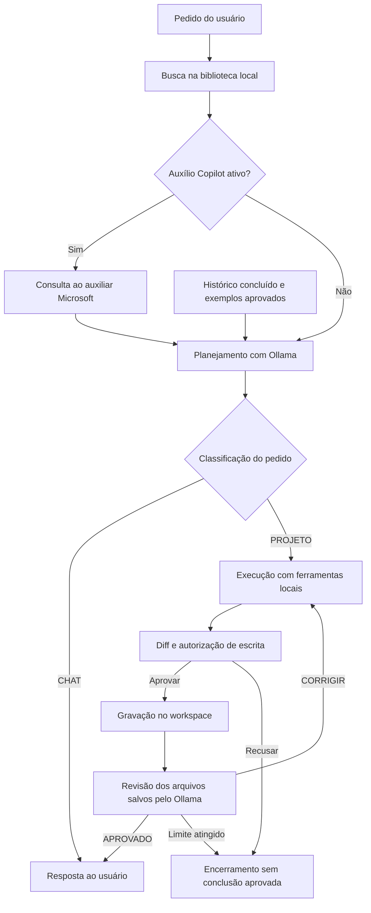

<div align="center">
  <h1>《 Knight Agent — Automação com IA local 》</h1>

  

  <p>Assistente Windows para conversar, analisar projetos e gerar código com Ollama, biblioteca local e aprovação de alterações.</p>

  <p>
    
    
    
    
    
    
  </p>
</div>

## Sumário

- [Sobre o Repositório](#sobre-o-repositório)
- [Módulos](#módulos)
  - [Mapa do código](#mapa-do-código)
- [Projeto](#projeto)
  - [Recursos e interface](#recursos-e-interface)
  - [Fluxo de uma solicitação](#fluxo-de-uma-solicitação)
  - [Ferramentas e aprovação de arquivos](#ferramentas-e-aprovação-de-arquivos)
  - [Biblioteca local de automação](#biblioteca-local-de-automação)
  - [Histórico, memória e persistência](#histórico-memória-e-persistência)
  - [Runtime e isolamento de rede](#runtime-e-isolamento-de-rede)
  - [Auxílio opcional do Copilot](#auxílio-opcional-do-copilot)
  - [Limites de funcionamento](#limites-de-funcionamento)
- [Tecnologias](#tecnologias)
  - [Aplicação e interface](#aplicação-e-interface)
  - [Dados e integrações](#dados-e-integrações)
  - [Distribuição e desenvolvimento](#distribuição-e-desenvolvimento)
- [Como Rodar](#como-rodar)
  - [Abrir o pacote Windows](#abrir-o-pacote-windows)
  - [Preparar o ambiente de desenvolvimento](#preparar-o-ambiente-de-desenvolvimento)
  - [Configurar a aplicação](#configurar-a-aplicação)
  - [Usar a CLI](#usar-a-cli)
  - [Importar documentos e preparar o modelo](#importar-documentos-e-preparar-o-modelo)
  - [Conectar o Copilot](#conectar-o-copilot)
  - [Empacotar e distribuir](#empacotar-e-distribuir)
  - [Testes e validações](#testes-e-validações)
  - [Diagnóstico](#diagnóstico)
- [Decisões e Desafios](#decisões-e-desafios)

## Sobre o Repositório

O **Knight Agent** é uma aplicação Python com interface desktop e CLI que usa um modelo Ollama instalado no computador para responder perguntas, consultar arquivos e produzir automações. A especialização cobre **Python, Excel VBA, Visual Basic .NET e Office Scripts** por meio de instruções e recuperação de referências locais.

O núcleo funciona offline: inicia seu próprio processo Ollama, consulta uma biblioteca SQLite e grava arquivos somente após autorização. O **Microsoft 365 Copilot** pode fornecer uma referência online complementar quando o usuário conecta uma conta compatível e ativa essa opção. Planejamento, edição e revisão continuam no Ollama.

A versão declarada em [pyproject.toml](pyproject.toml) é **0.3.0**. Este documento descreve o código-fonte atual; a presença de executáveis na pasta não comprova que tenham sido reconstruídos a partir da mesma revisão.

## Módulos

| Módulo | Entrega | Descrição |
| --- | --- | --- |
| Aplicação desktop | `KnightAgent.exe` / `knightagent-gui` | Interface, histórico, configurações, aprovação de diffs e gerenciamento do Ollama. |
| Interface de terminal | `knightagent` | Conversa, teste do modelo, biblioteca e preparação do perfil de automação. |
| Auxiliar Microsoft | `KnightAgentCopilot.exe` | Processo separado para autenticação e consultas ao Microsoft 365 Copilot. |
| Motor de inferência | `runtime/ollama/` e modelos locais | Dependência distribuída separadamente; seu ciclo de vida é administrado pela aplicação. |

### Mapa do código

```text
KnightAgeent/
├── pyproject.toml                 # Pacote, dependências e comandos instaláveis
├── config.example.yaml           # Configuração de referência
├── config.example.toml           # Alternativa TOML
├── src/knightagent/
│   ├── agent/                    # Orquestração, validação e memória
│   ├── cli/                      # Entrada e comandos de terminal
│   ├── config/                   # Leitura, migração e perfis de recursos
│   ├── gui/                      # Interface Tkinter, histórico e assets
│   ├── knowledge/                # Importação, guias incluídos e busca FTS5
│   ├── providers/                # Contrato e cliente HTTP do Ollama
│   ├── tools/                    # Operações de arquivo no workspace
│   ├── automation_model.py       # Perfil especializado
│   ├── runtime.py                # Processo Ollama e pré-carga
│   ├── offline.py                # URLs e modelos locais
│   ├── network_guard.py          # Verificação do Firewall do Windows
│   ├── copilot_client.py         # IPC com o auxiliar
│   ├── copilot_helper.py         # Entrada e protocolo do auxiliar
│   ├── copilot_auth.py           # Login, cache e Microsoft Graph
│   └── copilot.py                # Compatibilidade com detecção do app Windows
├── scripts/                      # Build, distribuição e verificações
├── tests/                        # Testes unittest
├── docs/                         # Guias de uso e configuração
└── runtime/                      # Runtime, modelos e sessões locais
```

Os arquivos `.sqlite3`, executáveis, atalhos, `build/`, `dist/`, caches e ambientes virtuais são dados ou artefatos locais, separados do código da aplicação.

| Arquivo ou grupo | Responsabilidade |
| --- | --- |
| [agent/loop.py](src/knightagent/agent/loop.py) | Classificação, contexto, execução de ferramentas e revisão. |
| [agent/parsing.py](src/knightagent/agent/parsing.py) | Validação de nomes, argumentos, tipos, limites e envelopes JSON. |
| [agent/memory.py](src/knightagent/agent/memory.py) | Exemplos aprovados e recuperação por similaridade de termos. |
| [tools/files.py](src/knightagent/tools/files.py) | Restrições de caminhos, diff, aprovação e gravação de texto. |
| [providers/base.py](src/knightagent/providers/base.py) e [ollama.py](src/knightagent/providers/ollama.py) | HTTP local, erros sanitizados, inventário, pré-carga e geração. |
| [providers/external.py](src/knightagent/providers/external.py) | Adaptadores aposentados que recusam uso; não habilitam provedores online. |
| [config/settings.py](src/knightagent/config/settings.py) e [performance.py](src/knightagent/config/performance.py) | Validação YAML/TOML, migração e perfis de recursos. |
| [knowledge/__init__.py](src/knightagent/knowledge/__init__.py) e [corpus.py](src/knightagent/knowledge/corpus.py) | Banco documental, importação, pesquisa e instruções de especialização. |
| [gui/main.py](src/knightagent/gui/main.py) e [settings.py](src/knightagent/gui/settings.py) | Janelas, filas de eventos, ações do usuário e configurações. |
| [gui/history.py](src/knightagent/gui/history.py) e [history_list.py](src/knightagent/gui/history_list.py) | Persistência e lista de conversas. |
| [gui/chat_widgets.py](src/knightagent/gui/chat_widgets.py), [buttons.py](src/knightagent/gui/buttons.py) e [theme.py](src/knightagent/gui/theme.py) | Cartões, linha do tempo, botões, rolagem, cores e animações. |
| [gui/branding.py](src/knightagent/gui/branding.py), [typography.py](src/knightagent/gui/typography.py) e [window_chrome.py](src/knightagent/gui/window_chrome.py) | Logo, fontes, ícones e integração da janela com Windows. |
| [cli/main.py](src/knightagent/cli/main.py) | Argumentos e execução dos comandos ou da conversa no terminal. |
| [runtime.py](src/knightagent/runtime.py), [offline.py](src/knightagent/offline.py) e [network_guard.py](src/knightagent/network_guard.py) | Processos, bloqueio de modelos remotos e verificação do isolamento de rede. |
| [automation_model.py](src/knightagent/automation_model.py) | Perfil Ollama com instruções especializadas e pesos locais existentes. |
| [copilot_client.py](src/knightagent/copilot_client.py), [copilot_helper.py](src/knightagent/copilot_helper.py) e [copilot_auth.py](src/knightagent/copilot_auth.py) | Comunicação Microsoft separada, IPC JSON e autenticação MSAL. |
| [copilot.py](src/knightagent/copilot.py) | Funções legadas de detecção/abertura manual do Copilot do Windows; não são o auxílio automático atual. |

## Projeto

### Recursos e interface

- **Conversa:** perguntas e continuidade dos últimos pedidos concluídos.
- **Projeto:** seleção da pasta de trabalho, leitura de arquivos, busca textual e criação/edição de código.
- **Acompanhamento:** linha do tempo com planejamento, ferramentas, gravações, revisão, erros e diffs copiáveis.
- **Histórico:** conversas por atividade recente, com título automático e restauração da pasta original.
- **Configurações por seção:** IA local, Copilot, Biblioteca e Dados locais; a navegação preserva alterações ainda não salvas.
- **Operações em segundo plano:** inicialização, geração, importação e conta usam threads; eventos chegam ao Tkinter por filas.

**Enter** envia e **Shift+Enter** insere uma linha. **Nova conversa** limpa o contexto ativo e mantém o histórico. **Pasta do projeto** muda o workspace e inicia uma conversa vazia. Durante uma tarefa, envio e troca de conversa/pasta ficam indisponíveis.

A interface usa texto selecionável, cartões e rolagem; não contém editor de código nem renderizador Markdown completo. O tema preserva o logo e as cores preta, laranja e branca, com ajuste de escala DPI. Os tamanhos mínimos são 900 × 680 para a janela principal e 850 × 640 para configurações, antes do ajuste de escala.

### Fluxo de uma solicitação



1. **Recuperação:** pesquisa referências locais para o pedido atual. Quando habilitado, consulta também o Copilot antes do planejamento. Falhas nesses complementos geram avisos e permitem continuar localmente.
2. **Planejamento:** recebe referências, exemplos semelhantes e até três pares recentes de pedido/resposta. Tem somente ferramentas de leitura. A primeira linha deve indicar `CHAT:` ou `PROJETO:`.
3. **Conversa:** uma resposta `CHAT:` é devolvida diretamente, sem edição ou revisão de arquivos.
4. **Execução:** recebe o pedido e um plano limitado a 4.000 caracteres. Pode ler, buscar, criar e editar arquivos. Descrever código não basta: precisa haver gravação com resultado `SALVO`.
5. **Revisão:** o orquestrador relê os arquivos alterados e entrega recortes ao revisor. Nessa etapa não há ferramentas. A primeira linha deve ser `APROVADO` ou `CORRIGIR`.
6. **Conclusão:** aprovação registra o resultado no diálogo e, havendo arquivos elegíveis, na memória. Correções retornam ao executor. Há até **três rodadas de execução/revisão**.

Cada fase possui limite de passos (`max_steps`, padrão 30) e tentativas de correção de formato (`format_attempts`, padrão 3). Cada resposta permite até oito chamadas de ferramentas, validadas antes da execução. Modelos com suporte nativo usam *tool calling*; os demais recebem um esquema JSON para `content` e `tool_calls`.

O contexto é limitado em caracteres serializados, incluindo as definições de ferramentas. Referências usam apenas o orçamento disponível; observações antigas podem ser removidas com aviso. Um pedido ainda excessivo causa erro. O cliente usa `stream: false`: a interface acompanha etapas, sem transmissão da resposta token a token. Os três papéis usam o mesmo provedor/modelo Ollama configurado.

### Ferramentas e aprovação de arquivos

| Ferramenta | Funcionamento | Limites principais |
| --- | --- | --- |
| `list_directory` | Lista uma pasta relativa; `.` representa a raiz. | Até 200 entradas, com aviso de truncamento. |
| `read_file` | Lê por deslocamento de caracteres e informa `next_offset`. | 4.000 caracteres por padrão; até 6.000 por trecho, sujeito ao limite da saída. |
| `search_text` | Busca literal recursiva em arquivos legíveis, sem seguir links. | Até 1.000 arquivos; aproximadamente 1 milhão de caracteres por arquivo; primeira ocorrência por arquivo. |
| `create_file` | Cria um arquivo ou propõe substituir um existente. | Diff e autorização; até 2.000.000 bytes. |
| `edit_file` | Substitui `old` por `new`. | `old` deve ocorrer exatamente uma vez; mesmo limite de tamanho e aprovação. |

Caminhos fornecidos às ferramentas devem ser relativos ao workspace. A validação rejeita `..`, caminhos absolutos, unidades/UNC, nomes reservados do Windows, fluxos alternativos de dados, symlinks, junctions/reparse points e arquivos com hard links. A busca ignora caminhos não permitidos.

Antes de gravar, a aplicação mostra um diff unificado. As opções são **Aprovar**, **Recusar** e **Aprovar tudo nesta sessão**; no terminal, `s`, `n` e `t`. Aprovar tudo permanece na instância ativa do agente, inclusive entre pedidos da mesma conversa. Nova conversa, troca de conversa/workspace ou reconstrução do agente elimina essa autorização; ela não é recuperada do histórico. O diff continua sendo exibido.

Uma recusa sinaliza o encerramento sem novas rodadas. Antes de aplicar uma alteração aprovada, o código verifica novamente o caminho e o conteúdo original para detectar mudanças durante a aprovação. Arquivos `.bas` e `.cls` usam **Windows-1252 e CRLF**; outros arquivos de texto usam UTF-8 e LF. Caracteres incompatíveis com Windows-1252 são recusados.

**Gravações já aprovadas permanecem no disco se uma etapa posterior falhar. Não há rollback automático nem transação entre vários arquivos.** A escrita de arquivos existentes também não usa substituição atômica por arquivo temporário.

### Biblioteca local de automação

A biblioteca fica em `knightagent-knowledge.sqlite3` e é consultada por GUI e CLI. [knowledge/corpus.py](src/knightagent/knowledge/corpus.py) contém **24 guias iniciais**: dez de Python, seis de VBA, dois de Visual Basic .NET e seis de Office Scripts. São guias do projeto com referências de origem, não cópias integrais de toda a documentação dessas tecnologias.

Os metadados ficam em `documents` e os trechos na tabela virtual SQLite **FTS5** `chunks`. O texto é dividido em blocos de até 2.600 caracteres, com sobreposição de 180. A busca normaliza acentos, expande alguns termos português/inglês, considera a família de linguagem e ordena por BM25. Retorna até quatro referências por padrão, evitando repetir o mesmo documento. Não há embeddings nem banco vetorial.

| Regra de importação | Comportamento |
| --- | --- |
| Formatos | `.txt`, `.md` e `.json`, em UTF-8 com BOM opcional. |
| Tamanho | Até 4.000.000 bytes por arquivo e 32.000.000 por lote. |
| Quantidade | Até 1.000 entradas de arquivos/diretórios por operação; até 1.000 documentos por JSON estruturado. |
| Origem | Disco local; URLs, caminhos de rede, unidades mapeadas de rede e links são rejeitados. |
| Reimportação | O mesmo caminho atualiza seus documentos, sem duplicá-los. |
| Falha parcial | Um arquivo inválido preserva sua importação anterior; outros arquivos válidos podem ser processados. |

A CLI importa diretórios recursivamente; a interface oferece seleção de arquivos. JSON comum é armazenado como texto formatado. JSON documental aceita um objeto com `text`, uma lista de documentos ou `{"documents": [...]}`; `title` e `family` são opcionais. A origem registrada é sempre o arquivo importado. PDF, DOCX e XLSX não são importados diretamente.

Não há sincronização web nem comando `knowledge sync` na versão atual. Documentos e registros antigos podem permanecer no banco; `official_documents` e `last_sync` são metadados históricos, não evidência de atualização online recente. Consulte contagens reais com `knowledge status`.

A documentação recuperada e a memória **não treinam os pesos do modelo**. O perfil opcional `knightagent-automation:latest` reutiliza pesos já instalados e acrescenta instruções; `prepare-model` informa `weights_trained: false`. A biblioteca não acompanha o uso isolado desse perfil fora do KnightAgent.

Detalhes: [Biblioteca de automação local](docs/biblioteca-automacao.md).

### Histórico, memória e persistência

| Dado | Local | Conteúdo e comportamento |
| --- | --- | --- |
| Configuração | YAML/TOML escolhido por `--config` | Workspace, modelo, limites, memória e IDs públicos do complemento. |
| Conversas | `knightagent-chats.sqlite3`, ao lado da configuração | Tabelas `chats` e `messages`: pedidos, respostas, eventos, diffs, decisões, erros e pasta do projeto. Usado pela GUI. |
| Exemplos aprovados | `knightagent-memory.sqlite3`, ao lado da configuração | Tabela `examples`: pedido, resumo e recortes de código de tarefas aprovadas pelo revisor. |
| Documentação | `knightagent-knowledge.sqlite3`, ao lado da configuração | Documentos, índice FTS5 e metadados históricos. |
| Conta Microsoft | `%LOCALAPPDATA%\KnightAgent\Copilot\` | Cache MSAL protegido por DPAPI, separado por client ID e tenant. |
| Pesos | Preferencialmente `runtime/models/` | Manifests e blobs locais do Ollama. |
| Sessão do motor | `runtime/sessions/ollama-*/` | Configuração temporária e `server.log`; remoção tentada ao encerrar. |
| Arquivos produzidos | Workspace selecionado | Conteúdo aprovado pelo usuário. |

Ao abrir uma conversa salva, o modelo recebe somente os **três últimos pares completos de pedido/resposta**. Eventos, diffs e autorizações continuam visíveis, mas não são restaurados como instruções. Pedidos interrompidos não retomam aprovações pendentes. A CLI mantém o diálogo apenas durante o processo; não usa o histórico da GUI.

A memória guarda até **500 exemplos**. Examina até os três primeiros caminhos alterados, em ordem, e salva recortes de até 3.000 caracteres de extensões `.py`, `.bas`, `.cls`, `.vb` e `.ts`. A recuperação compara termos dos pedidos entre até 300 exemplos recentes e seleciona até três. O escopo padrão `global` permite reutilização entre projetos; `workspace` restringe a busca à pasta atual.

Em **Dados locais**, desativar a memória interrompe seu uso sem apagar registros. **Limpar histórico de chats** e **Resetar memória local** exigem confirmação e operam sobre bancos diferentes. Nenhuma dessas ações remove biblioteca, pesos ou arquivos do projeto. Não há sincronização de conversas com uma conta do KnightAgent.

Os bancos SQLite não recebem criptografia da aplicação e podem conter código e diffs. Para backup, encerre o aplicativo e copie configuração, bases e projetos necessários. Tokens Microsoft são vinculados ao usuário Windows e não devem ser distribuídos com o pacote.

### Runtime e isolamento de rede

A GUI inicia o Ollama e pré-carrega o modelo automaticamente. Não é necessário executar `ollama serve` manualmente. A CLI também administra um servidor próprio; a geração carrega o modelo quando necessário.

- O servidor usa `127.0.0.1` e porta livre por sessão. O endereço efetivo substitui `ollama.url` em memória.
- O processo recebe diretório próprio, `OLLAMA_NO_CLOUD=1` e `disable_ollama_cloud: true` no arquivo do servidor. Proxies, variáveis de credenciais e configurações Ollama herdadas são filtrados.
- O runtime limita a operação a um modelo carregado e uma geração paralela, com fila máxima de quatro. O padrão `keep_alive: '-1'` mantém o modelo residente até encerrar o motor.
- A inicialização exige que o log do próprio filho confirme a porta e a desativação da nuvem; outro serviço existente não é reutilizado silenciosamente.
- O cliente HTTP aceita somente loopback e endpoints de inventário, geração e criação de perfil local. Downloads, pesquisa web e APIs externas não estão disponíveis ao agente.
- Nomes e metadados são verificados para bloquear modelos cloud, inclusive aliases que apontem para modelos remotos.
- No Windows, um **Job Object** vincula servidor e filhos ao ciclo de vida do aplicativo. Encerrar a aplicação encerra seu motor.

A descoberta do executável prioriza `runtime/ollama/` junto à configuração, depois junto ao Python/executável. Há alternativas na instalação local do Ollama e no `PATH`, mas elas também precisam satisfazer a verificação de firewall. O procedimento de distribuição prepara especificamente o runtime privado.

Para pesos, a ordem é `runtime/ollama/models/`, `runtime/models/`, variável `OLLAMA_MODELS` e, por último, `%USERPROFILE%\.ollama\models`. Runtime e pesos não podem estar em compartilhamentos de rede ou caminhos com junctions/symlinks.

No Windows, o início exige os três perfis de firewall ativos e regras efetivas de saída no grupo **KnightAgent Offline** para os executáveis do runtime. No pacote congelado, `KnightAgent.exe` também precisa estar coberto. As regras bloqueiam destinos fora do loopback em IPv4/IPv6; o auxiliar Copilot tem comunicação separada.

O firewall é verificado na inicialização, sem monitoramento contínuo. A proteção depende de ele permanecer ativo. Em execução pelo código-fonte, o script não aplica um bloqueio geral a `python.exe`; não se deve atribuir ao interpretador a mesma regra por executável usada no pacote. A aplicação não modifica o firewall silenciosamente.

Opções de nuvem e retenção do modelo: [documentação oficial do Ollama](https://docs.ollama.com/faq).

### Auxílio opcional do Copilot

O complemento usa a **Microsoft 365 Copilot Chat API** via Microsoft Graph. Não automatiza a interface do Copilot instalado e não é GitHub Copilot.

1. O usuário conecta sua conta Microsoft por login no navegador.
2. **Verificar acesso** testa a autorização da conta para a API.
3. **Ativar auxílio automático do Copilot**, seguido de **Salvar configurações**, habilita consultas nos próximos pedidos. Login sozinho não ativa envio.
4. O agente envia uma instrução técnica fixa e até **4.000 caracteres do pedido atual**.
5. A resposta, limitada a **6.000 caracteres**, entra como referência não confiável no contexto do Ollama, sujeita ao orçamento restante.

Arquivos, histórico, exemplos e biblioteca não são anexados automaticamente. Informações incluídas pelo usuário no pedido fazem parte da consulta online. O Copilot não executa ferramentas, não aprova diffs e não assume papéis do agente. Falha de rede, licença ou autenticação gera aviso e a tarefa continua localmente.

O processo principal chama `KnightAgentCopilot.exe` por IPC JSON em entrada/saída padrão. Em desenvolvimento, chama o módulo instalado em modo isolado do Python (`-I`). O auxiliar aceita operações de estado, login, logout, verificação e consulta; não devolve tokens ao agente. O cache é protegido por DPAPI para o usuário Windows. A desconexão remove a sessão local do KnightAgent, sem encerrar sessões de outros aplicativos Microsoft.

Cada consulta cria uma conversa na API; o código habilita fundamentação web nessa chamada. Isso não dá ao Ollama uma ferramenta de navegação. O histórico local não é transferido como conversa Microsoft.

O código usa endpoints `/beta`, conta de trabalho/escola e permissões delegadas. A Microsoft exige licença adicional Microsoft 365 Copilot; conta pessoal e apenas instalar o aplicativo não atendem aos requisitos. APIs `/beta` estão sujeitas a alteração e não têm suporte para uso em produção. Consulte [requisitos e capacidades](https://learn.microsoft.com/en-us/microsoft-365/copilot/extensibility/api/ai-services/chat/overview) e [permissões da API](https://learn.microsoft.com/en-us/microsoft-365/copilot/extensibility/api/ai-services/chat/copilotroot-post-conversations).

### Limites de funcionamento

- O agente **gera e edita texto**, mas não executa Python, macros, Office Scripts, shell ou builds dos projetos produzidos. Não possui ferramenta dedicada para manipular planilhas binárias.
- A revisão é feita pelo modelo sobre recortes limitados. `APROVADO` não significa compilação, teste automatizado ou validação no Office.
- Referências são dados, nunca instruções. Isso reduz a influência de conteúdo importado, mas não garante respostas corretas nem elimina o conhecimento prévio dos pesos.
- Não há botão de cancelamento de tarefa. É necessário resolver a aprovação e aguardar a execução antes de fechar. Fechar durante a inicialização encerra o runtime em preparação.
- Não há exclusão de arquivos por ferramenta, terminal integrado, atualização automática de modelos ou integração ativa com OpenAI/Anthropic/Gemini.
- Desempenho e aceleração CPU/GPU dependem de modelo, contexto, RAM/VRAM, drivers e runtime. Não há requisito universal de memória nem ganho percentual garantido.

## Tecnologias

### Aplicação e interface

| Tecnologia | Uso |
| --- | --- |
| Python ≥ 3.10 | Aplicação, threads, filas, processos, acesso a arquivos e testes. |
| Tkinter / ttk | Interface desktop; exige Tcl/Tk funcional no Python de desenvolvimento. |
| HTTPX ≥ 0.27, < 1 | HTTP para Ollama e, exclusivamente no auxiliar, Microsoft. |
| PyYAML ≥ 6, < 7 | Leitura validada e gravação YAML. |
| `tomllib` / Tomli ≥ 2 | Leitura TOML; Tomli é instalado somente em Python anterior ao 3.11. |

### Dados e integrações

| Tecnologia | Uso |
| --- | --- |
| SQLite com FTS5 | Histórico, exemplos e pesquisa textual, sem servidor de banco. |
| Ollama local | Inferência e criação de perfil; versão não fixada no manifest, mas deve suportar o modo sem nuvem exigido pelo runtime. |
| MSAL ≥ 1, < 2 | Autenticação delegada Microsoft. |
| MSAL Extensions ≥ 1, < 2 | Persistência do cache com DPAPI no Windows. |
| Microsoft Graph `/beta` | API opcional de conversas do Microsoft 365 Copilot. |

### Distribuição e desenvolvimento

| Tecnologia | Uso |
| --- | --- |
| Setuptools ≥ 68 | Backend de build e comandos `knightagent`/`knightagent-gui`. |
| PyInstaller | Dois executáveis Windows; ferramenta de desenvolvimento, sem versão fixada no manifest. |
| PowerShell | Build, atalho, firewall e validações do pacote. |
| Windows Firewall, Job Objects e DPAPI | Rede, ciclo de vida dos filhos e proteção de tokens. |
| `unittest` e mocks | Testes de lógica, interface e integração entre componentes. |

## Como Rodar

### Abrir o pacote Windows

1. Mantenha juntos `KnightAgent.exe`, `KnightAgentCopilot.exe`, `config.yaml` e `runtime/`, com as bibliotecas do Ollama e os pesos selecionados. Use pasta local gravável.
2. Após preparar o pacote, execute uma vez em **PowerShell como Administrador**, a partir da pasta do aplicativo:

   ```powershell
   powershell -NoProfile -ExecutionPolicy Bypass -File .\scripts\configure-offline-firewall.ps1
   ```

3. Abra `KnightAgent.exe`, `Knight Agent.lnk` ou `Abrir KnightAgent.cmd` e aguarde a IA local ficar pronta.
4. Selecione **Pasta do projeto**, envie um pedido e revise o diff antes de autorizar a gravação.

Exemplo de pedido: `Crie contar_linhas.py para ler entrada.csv com csv.DictReader, contar as linhas e imprimir o total. Use UTF-8 com BOM opcional. Não execute o código.`

O executável inclui Python e interface; runtime e pesos são separados. O `.cmd` prefere o executável e, se ausente, usa `.venv\Scripts\pythonw.exe`. Se mover a pasta, reaplique firewall e recrie o atalho. O script de firewall não altera outras instalações do Ollama.

### Preparar o ambiente de desenvolvimento

Pré-requisitos: Python 3.10 ou superior com Tkinter e SQLite FTS5, Windows para a distribuição completa, PowerShell e espaço para runtime/modelos. A instalação abaixo pode acessar a internet; o núcleo não baixa essas dependências durante o uso normal.

Na raiz do projeto:

```powershell
py -3 -m venv .venv
.\.venv\Scripts\python.exe -m pip install -e .

# Criar a configuração somente se ainda não existir.
if (-not (Test-Path -LiteralPath .\config.yaml)) {
    Copy-Item -LiteralPath .\config.example.yaml -Destination .\config.yaml
}
```

Para conversar com a IA, disponibilize runtime/modelos e aplique o firewall conforme [Empacotar e distribuir](#empacotar-e-distribuir). Em uma cópia sem executáveis, gere-os antes de executar o script de firewall: ele exige `KnightAgent.exe` e o runtime privado.

```powershell
# Interface a partir do código instalado.
.\.venv\Scripts\python.exe -m knightagent.gui.main --config .\config.yaml

# Alternativa criada pela instalação.
.\.venv\Scripts\knightagent-gui.exe --config .\config.yaml
```

Não é necessário ativar o ambiente virtual para usar esses comandos. Instalar o pacote é necessário para que o auxiliar em modo isolado encontre seus módulos.

### Configurar a aplicação

Exemplos completos: [config.example.yaml](config.example.yaml) e [config.example.toml](config.example.toml). `--config` seleciona o arquivo. A GUI grava YAML; se aberta com TOML, salvar cria o YAML de mesmo nome e mantém o TOML original.

| Campo | Padrão / referência | Efeito e limites |
| --- | --- | --- |
| `workspace` | `.` | Pasta existente; relativo à pasta da configuração. |
| `ollama.model` | `qwen2.5:7b` no exemplo | Obrigatório; modelo já instalado. |
| `ollama.url` | `http://127.0.0.1:11434` no exemplo | HTTP loopback; runtime substitui a porta em memória. Sem o campo, carregador usa `11435`. |
| `timeout` | `120` | Timeout HTTP em segundos; 1 a 3.600. |
| `max_steps` | `30` | Ciclos por fase; 1 a 200. |
| `context_chars` | `24000` | Contexto serializado em caracteres; 8.000 a 200.000. Não equivale a tokens. |
| `tool_output_chars` | `6000` | Observações de ferramentas; 256 a 20.000 caracteres. |
| `format_attempts` | `3` | Tentativas de correção do formato; 1 a 5. |
| `ollama.num_ctx` | `8192` | Contexto do modelo em tokens; 2.048 a 131.072. |
| `ollama.num_predict` | `2048` | Saída em tokens; 128 a 16.384. |
| `ollama.keep_alive` | `'-1'` | Strings `'-1'`, `'0'`, `'5m'` ou `'30m'`; perfis da GUI usam `'-1'`. |
| `performance.level` | `medio` | `baixo`, `medio` ou `alto`; salvar na GUI aplica o perfil. |
| `memory.enabled` | `true` | Usar e registrar exemplos aprovados. |
| `memory.scope` | `global` | `global` ou `workspace`; configurado no arquivo. |
| `knowledge.enabled` | `true` | Compatibilidade: sempre normalizado para `true`. |
| `knowledge.max_chars` | `6000` | Referências: 500 a 12.000 caracteres, sujeitos ao contexto total. |
| `complementary.copilot` | `false` | Ativar consultas complementares após configurar a conta. |
| `complementary.mode` | `account` | Único modo atual. |
| `complementary.client_id` | Vazio | UUID público do registro Entra; necessário para conectar. |
| `complementary.tenant` | `organizations` | `organizations` ou UUID do diretório; domínio textual não é aceito. |
| `roles` | Todos `ollama` | `planner`, `executor` e `reviewer` são normalizados para o provedor local. |

| Perfil da GUI | Contexto | Saída | Permanência |
| --- | --- | --- | --- |
| Baixo | 4.096 tokens | 1.024 tokens | Até encerrar o motor |
| Médio | 8.192 tokens | 2.048 tokens | Até encerrar o motor |
| Alto | 16.384 tokens | 4.096 tokens | Até encerrar o motor |

Alterar apenas `performance.level` manualmente não recalcula os números ao carregar: ajuste também `ollama.num_ctx`/`num_predict`, ou salve o perfil pela GUI. Mudanças no modelo/parâmetros reiniciam e pré-carregam o runtime; ajustes somente no Copilot não reiniciam um motor pronto.

YAML usa carregador seguro que rejeita chaves duplicadas/não textuais. Campos desconhecidos são rejeitados. `user` e `providers` legados são descartados em memória e removidos ao salvar. Copilot antigo sem `mode` é migrado com auxílio desativado, evitando transformar uso manual em envio automático. Credenciais antigas no Windows não são lidas nem removidas pela migração.

Não há `.env` obrigatório, chave de API ou segredo de cliente para uso local. Guia das telas: [Configurações](docs/configuracoes.md).

### Usar a CLI

Execute na raiz; opções globais vêm antes do subcomando:

```powershell
.\.venv\Scripts\knightagent.exe --help

# Conversa interativa. Digite /sair para encerrar.
.\.venv\Scripts\knightagent.exe --config .\config.yaml

# Substituir pasta e modelo somente nesta execução.
.\.venv\Scripts\knightagent.exe --config .\config.yaml --workspace C:\Projetos\Automacoes --model qwen2.5:7b

# Iniciar o runtime, conferir inventário/modelo e encerrar.
.\.venv\Scripts\knightagent.exe --config .\config.yaml test-connection ollama
```

O workspace deve existir. `python.exe -m knightagent.cli.main` também pode substituir `knightagent.exe`. A GUI aceita `--config`; `--workspace` e `--model` são opções da CLI.

`test-connection` verifica presença e metadados do modelo, sem garantir qualidade da geração. `knowledge status`, `search` e `import` não iniciam Ollama: funcionam sem pesos ou firewall do runtime. A CLI não oferece login Copilot; a conta é preparada pela interface.

### Importar documentos e preparar o modelo

```powershell
.\.venv\Scripts\knightagent.exe --config .\config.yaml knowledge status
.\.venv\Scripts\knightagent.exe --config .\config.yaml knowledge search 'VBA copiar colunas'
.\.venv\Scripts\knightagent.exe --config .\config.yaml knowledge import C:\Documentacao\guia.md
.\.venv\Scripts\knightagent.exe --config .\config.yaml knowledge import C:\Documentacao\Python --family python
```

Use caminhos locais existentes. A família aceita até 50 letras minúsculas, números e sublinhados, começando por letra. O relatório contém `documents_imported`, `documents_failed`, `documents_skipped` e detalhes; código de saída `1` indica ao menos uma falha, mesmo com sucesso parcial.

Exemplo de JSON documental:

```json
{
  "documents": [
    {
      "title": "Padrão de leitura de CSV",
      "family": "python",
      "text": "Use csv.DictReader com encoding utf-8-sig e newline vazio."
    }
  ]
}
```

Para criar o perfil, a base deve existir no armazenamento de modelos usado pelo runtime:

```powershell
.\.venv\Scripts\knightagent.exe --config .\config.yaml knowledge prepare-model --base qwen2.5:7b --name knightagent-automation:latest
```

O comando inicia/encerra o runtime, valida a base e cria o perfil especializado. Não baixa pesos, não faz fine-tuning e não altera a seleção salva. Depois, escolha `knightagent-automation:latest` em **IA local** e salve.

### Conectar o Copilot

1. A TI registra um cliente público no Entra, com plataforma **Mobile and desktop applications**, redirecionamento `http://localhost` e sem segredo de cliente.
2. Autoriza os escopos delegados usados pelo código: `Sites.Read.All`, `Mail.Read`, `People.Read.All`, `OnlineMeetingTranscript.Read.All`, `Chat.Read`, `ChannelMessage.Read.All` e `ExternalItem.Read.All`, conforme a política da organização.
3. Em **Configurações → Copilot → Mostrar configuração da TI**, informa client ID/tenant e salva.
4. Cada usuário escolhe **Entrar com conta Microsoft**, conclui o login e usa **Verificar acesso**.
5. Para permitir consultas, marca **Ativar auxílio automático do Copilot** e salva novamente.

**Trocar conta** inicia outro login; **Desconectar** remove a sessão local. O botão **Conta Copilot** aparece no compositor quando o complemento está habilitado e abre suas configurações.

Essas permissões permitem fundamentação em dados corporativos acessíveis à conta, mesmo sem anexar arquivos do workspace. A disponibilidade depende de licença, consentimento e políticas do tenant. Procedimento completo: [Login e auxílio do Copilot](docs/copilot-login.md).

### Empacotar e distribuir

1. Instale o empacotador e gere os executáveis:

   ```powershell
   .\.venv\Scripts\python.exe -m pip install pyinstaller
   powershell -NoProfile -ExecutionPolicy Bypass -File .\scripts\build-desktop.ps1
   ```

   PyInstaller `--onefile` gera `KnightAgent.exe` sem console e `KnightAgentCopilot.exe` com entrada/saída padrão. Imagens e ícone acompanham o principal. Temporários ficam em `build/`.

2. Disponibilize **`ollama.exe` e a pasta `lib/` de uma instalação Windows compatível** em `runtime/ollama/`. O build não copia esses arquivos nem instala Ollama. O runtime privado não precisa do aplicativo gráfico/updater.

3. Disponibilize manifests e blobs em `runtime/models/`. Para usar o script de cópia, os dois modelos previstos devem existir em `%USERPROFILE%\.ollama\models`:

   ```powershell
   .\.venv\Scripts\python.exe .\scripts\bundle-local-models.py
   ```

   A lista é fixa: `knightagent-automation:latest` e `qwen2.5:7b`. O script verifica tamanho/SHA-256 dos blobs, evita cópias repetidas de blobs compartilhados e grava `build/bundled-models.json`. Não baixa modelos nem usa `OLLAMA_MODELS` como origem. Se os modelos estiverem em outra pasta, prepare o armazenamento de destino separadamente. SHA-256 é conferido nessa cópia, não a cada abertura.

4. Confira `config.yaml`, aplique o firewall como Administrador e recrie o atalho:

   ```powershell
   powershell -NoProfile -ExecutionPolicy Bypass -File .\scripts\configure-offline-firewall.ps1
   powershell -NoProfile -ExecutionPolicy Bypass -File .\scripts\create-shortcut.ps1
   ```

5. Distribua a pasta com os dois executáveis, configuração, runtime, modelos e scripts/documentação de instalação. Bases existentes podem acompanhar uma migração quando os dados devam ser preservados; novas bases são criadas quando necessário. Não inclua cache de tokens de outro usuário.

Pesos e bibliotecas CPU/GPU representam a maior parte do tamanho, que varia conforme a distribuição. O atalho usa caminho absoluto e deve ser recriado após mudança de pasta; regras de firewall também dependem dos caminhos dos executáveis.

Para produzir somente o pacote Python:

```powershell
.\.venv\Scripts\python.exe -m pip wheel . --no-deps --wheel-dir .\dist
```

O wheel inclui módulos e assets declarados no manifest. Runtime, pesos e bases pessoais não fazem parte dele.

### Testes e validações

```powershell
.\.venv\Scripts\python.exe -m unittest discover -s tests -v
```

A suíte cobre arquivos/codificação, chamadas de ferramentas, conversa/projeto, memória, biblioteca, importação, CLI, configuração, histórico, GUI, runtime, firewall e cooperação Copilot. Testes de serviços usam mocks/respostas simuladas; GUI exige Tcl/Tk funcional.

Na revisão documental de **03/10/2026**, a suíte no Windows apresentou **218 testes, `OK (skipped=1)`**. A primeira execução no ambiente restrito não conseguiu carregar Tcl/Tk; a execução com acesso ao runtime local concluiu a suíte. Isso não valida uma conta corporativa real, licença Microsoft ou execução dos códigos gerados no Office.

| Script | Verificação / resultado | Pré-requisitos e efeitos |
| --- | --- | --- |
| [validate-offline.py](scripts/validate-offline.py) | Inicialização, pré-carga, resposta apoiada na biblioteca, zero gravações e encerramento. | Runtime, pesos, firewall, configuração e `build/`; gera `build/offline-smoke.json`. |
| [validate-desktop-package.ps1](scripts/validate-desktop-package.ps1) | Abre executável, verifica pré-carga e encerramento com Ollama. | Pacote/firewall; inicia e fecha processos reais. |
| [validate-copilot-package.py](scripts/validate-copilot-package.py) | Auxiliar empacotado, cache DPAPI sintético e logout. | Windows, auxiliar e `build/`; sem conta real/rede. |
| [validate-copilot-lifecycle.ps1](scripts/validate-copilot-lifecycle.ps1) | Encerrar o processo externo também encerra o filho do auxiliar. | Auxiliar empacotado; sem login/consulta. |
| [validate-automation.py](scripts/validate-automation.py) | Exemplos Python/VBA/VB.NET/Office Scripts, sintaxe/estrutura e escrita pelo agente. | Usa diretamente `ollama.url` sem iniciar `OllamaRuntime`. Grava e aprova automaticamente escritas em `build/automation-validation/`. |

Após preparar o pacote, execute as validações manuais separadamente:

```powershell
.\.venv\Scripts\python.exe .\scripts\validate-offline.py
powershell -NoProfile -ExecutionPolicy Bypass -File .\scripts\validate-desktop-package.ps1
.\.venv\Scripts\python.exe .\scripts\validate-copilot-package.py
powershell -NoProfile -ExecutionPolicy Bypass -File .\scripts\validate-copilot-lifecycle.ps1
```

`validate-automation.py` exige endpoint local já ativo e corretamente configurado. A porta privada da GUI não é salva automaticamente no YAML. O script não compila VB.NET nem executa Excel, VBA ou Office Scripts; os artefatos exigem validação no destino.

Os scripts manuais foram analisados, mas não executados nesta revisão documental.

### Diagnóstico

| Sintoma | Causa provável / ação |
| --- | --- |
| Runtime Ollama ausente | Preparar `runtime/ollama/ollama.exe` e bibliotecas. |
| Bloqueio de rede não confirmado | Verificar Firewall ativo e reaplicar o script como Administrador, especialmente após mover/atualizar o runtime. |
| Cloud desativado não confirmado | Usar runtime compatível com `OLLAMA_NO_CLOUD`; é exigida confirmação no log do próprio processo. |
| Modelo ausente ou remoto bloqueado | Disponibilizar pesos no armazenamento usado e selecionar um modelo local. Não há download automático. |
| Timeout ou falta de memória | Reduzir modelo/contexto, usar perfil baixo ou ajustar `timeout` conforme a etapa. |
| Limite de saída atingido | Aumentar `num_predict` ou dividir a tarefa; chamadas de uma resposta truncada não são executadas. |
| Pedido excede o contexto | Reduzir pedido/trechos; contexto em caracteres e janela em tokens são limites distintos. |
| `old` não corresponde a uma ocorrência | Reler o arquivo e fornecer substituição exata e única. |
| Arquivo mudou durante aprovação | Reler a versão atual e produzir outro diff. |
| Caractere incompatível com Windows-1252 | Adequar texto de `.bas`/`.cls` à codificação exigida. |
| Documento não importado | Conferir extensão, UTF-8, tamanho, estrutura JSON e disco local. |
| Login concluído sem acesso ao Copilot | Usar Verificar acesso e conferir licença, consentimento e registro Entra com a TI. |
| Auxiliar Microsoft ausente | Reconstruir os dois executáveis e mantê-los juntos. |
| `Can't find a usable init.tcl` | Conferir Tcl/Tk e o ambiente virtual; restrições do ambiente também podem impedir carregamento. |

## Decisões e Desafios

<details>
<summary>Servidor Ollama próprio e encerramento controlado</summary>

[runtime.py](src/knightagent/runtime.py) cria um processo com porta, ambiente e diretório próprios, exige confirmação no log e controla seus filhos no Windows. Isso evita depender de um serviço aberto manualmente. A distribuição precisa incluir runtime, pesos e regras de firewall compatíveis.

</details>

<details>
<summary>Complemento Microsoft em processo separado</summary>

O auxiliar preserva o bloqueio de internet do executável principal enquanto permite autenticação e consultas opcionais. O contrato IPC limita operações, tamanhos e informações devolvidas. O custo é distribuir um segundo executável e depender dos requisitos da API e da organização.

</details>

<details>
<summary>Conhecimento recuperado e memória sem treinamento</summary>

FTS5 e exemplos aprovados fornecem contexto em tempo de execução. Isso permite adicionar procedimentos locais sem retreinar pesos e sem serviço de embeddings. A busca é lexical, tem limites e pode não recuperar a referência necessária; o modelo deve indicar lacunas.

</details>

<details>
<summary>Diff antes da escrita e revisão sem executar código</summary>

O planejador recebe leitura, o executor recebe escrita controlada e o revisor recebe recortes já salvos. Essa separação limita ações por etapa e evita ciclos de releitura na revisão. Aprovação do usuário e revisão pelo modelo não substituem testes; falhas posteriores não desfazem alterações autorizadas.

</details>

<details>
<summary>Interface responsiva e contexto persistente limitado</summary>

Threads executam operações demoradas e filas levam resultados ao Tkinter. O histórico conserva eventos, mas somente pares completos recentes voltam ao modelo. Autorizações antigas não se tornam novas instruções. A interface bloqueia navegação durante a tarefa e ainda não implementa cancelamento interativo.

</details>

<details>
<summary>Migração explícita para a edição local</summary>

O carregador descarta perfis/provedores antigos, fixa os papéis no Ollama e mantém a biblioteca obrigatória. Adaptadores externos antigos recusam uso. Copilot é uma opção independente com ativação explícita; configurações legadas de uso manual não ativam envio automático.

</details>
